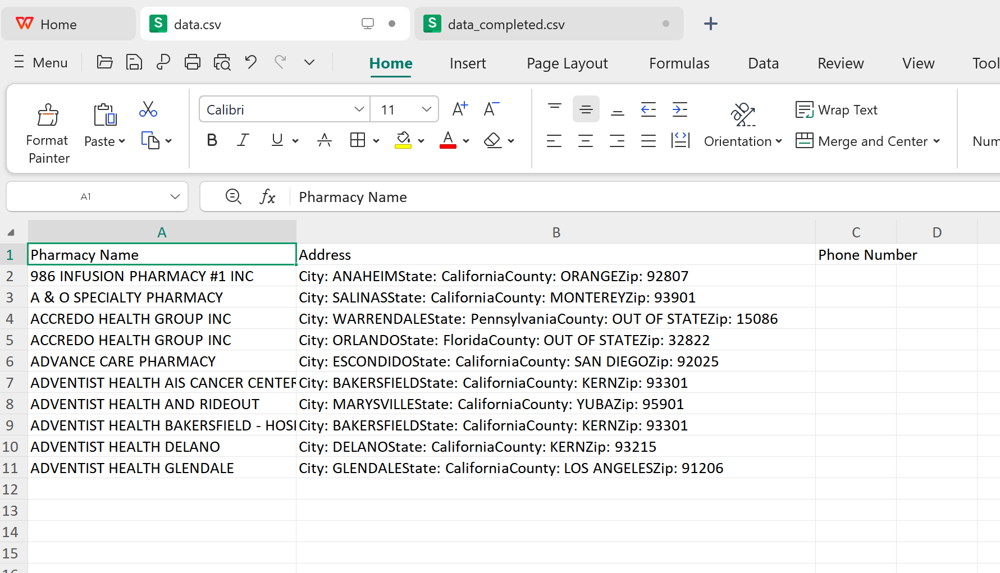
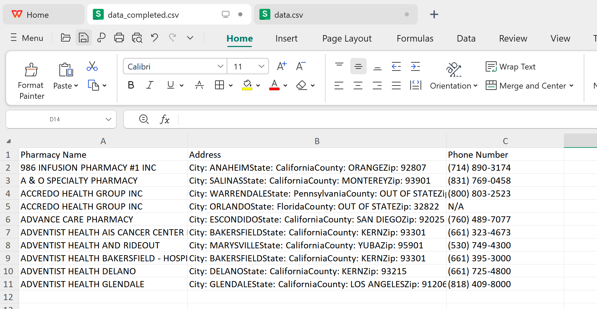

# Fetch Phone Numbers from Google Places API

## 📌 项目简介
本项目使用 Google Places API 通过药店名称和地址获取电话号码，并将结果存入 `data_completed.csv` 文件。

## 💻 运行步骤

### 1. 打开命令行窗口（CMD）
在 Windows 搜索框中输入 **cmd**，然后点击打开命令提示符窗口。

### 2. 检查是否安装 Python
在命令行窗口输入以下命令检查 Python 是否已安装：

```sh
python --version
```

如果看到 Python 版本号，说明已安装；如果未安装，请先下载并安装 [Python](https://www.python.org/downloads/)。

### 3. 准备数据文件
确保你的数据表格命名为 **`data.csv`**，并放置在 **与脚本相同的文件夹** 内。

### 4. 配置 Google API Key
1. 在 `google_api.txt` 文件中存放你的 Google API Key。
2. 确保 `google_api.txt` 和 `fetch_phone_numbers_google.py` 在同一个文件夹中。

### 5. 运行脚本
在 CMD 窗口中，进入脚本所在的文件夹，然后输入以下命令运行脚本：

```sh
py fetch_phone_numbers_google.py
```

### 6. 查看结果
程序运行完毕后，会生成 `data_completed.csv`，其中包含药店的电话号码。

## 🎯 注意事项
- `data.csv` 必须包含 `Pharmacy Name` 和 `Address` 列。
- 需要有 **有效的 Google Places API Key**，否则无法获取数据。
- API 访问可能有速率限制，每次请求之间会有短暂延迟。

✅ 现在，你可以轻松地从 Google Places API 获取电话号码了！


数据表格


完成表格
